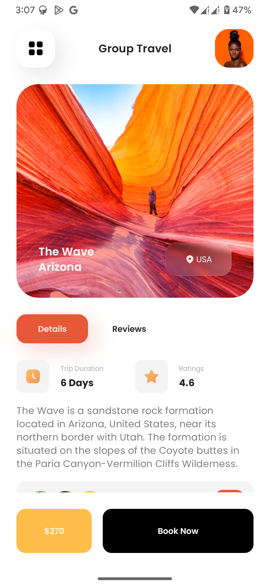

# 🧳 [Qclay Trip](https://dribbble.com/shots/15630429-Travel-app-ui)
 

## ✨ About & Features
This project shows you how to create custom modifiers for colored shadows, arrange components vertically, and set pixel-perfect borders on components.

## 🔗 Useful Links
- https://developer.android.com/codelabs/jetpack-compose-layouts?hl=en#0
